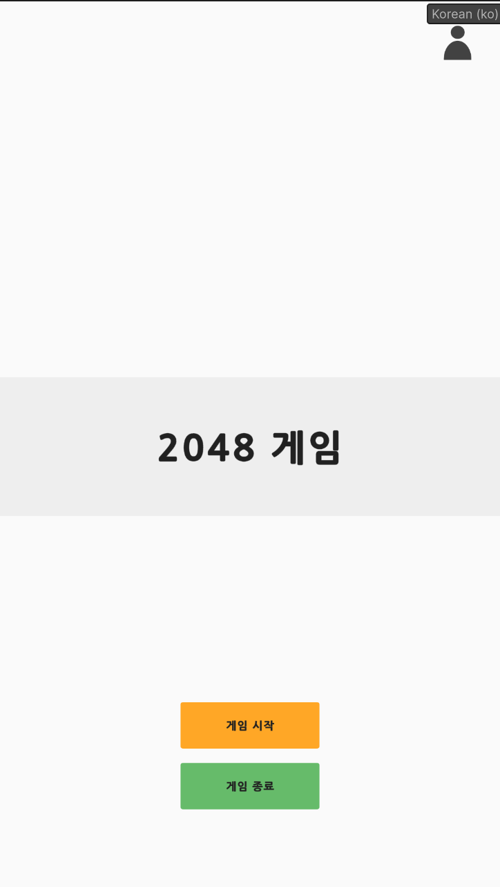
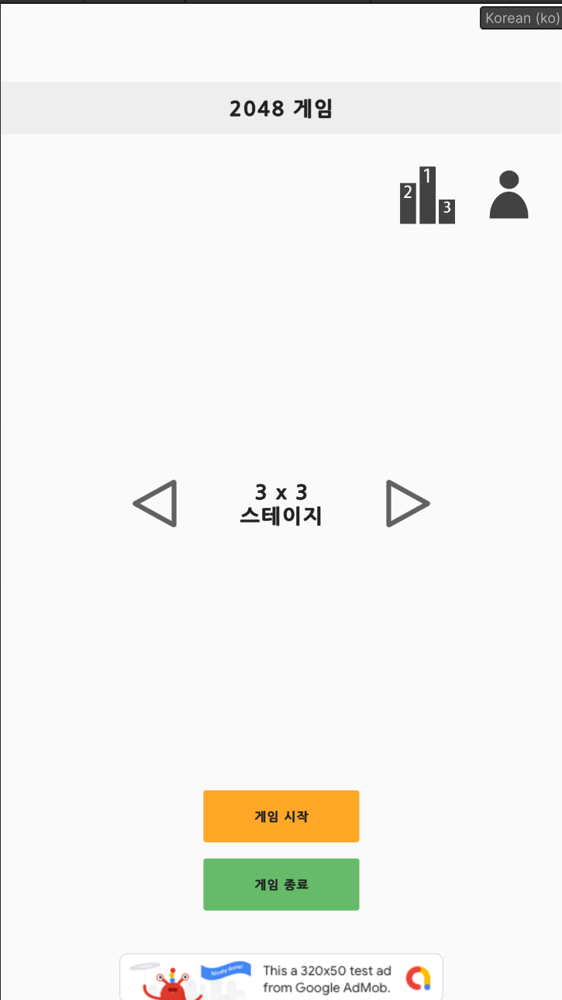
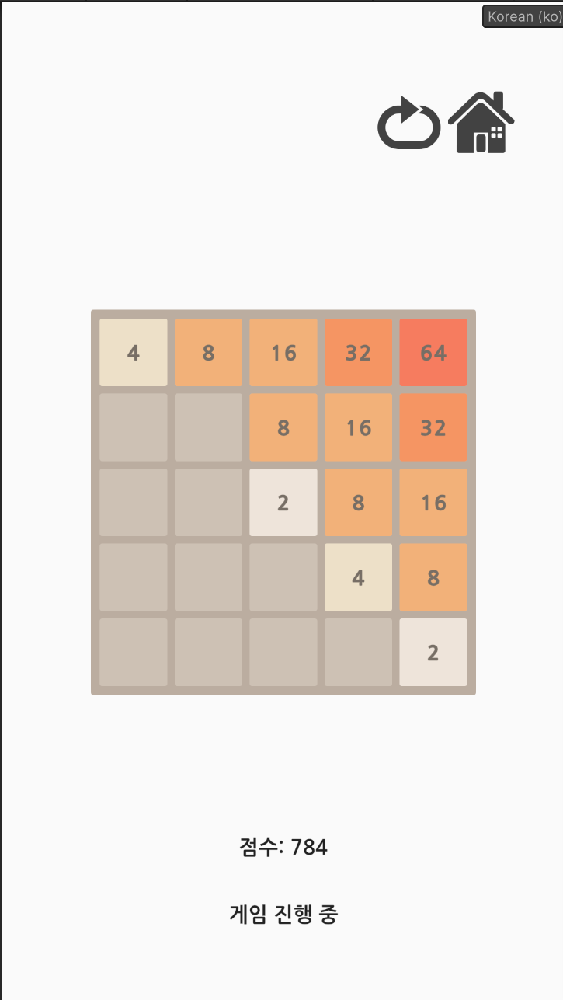
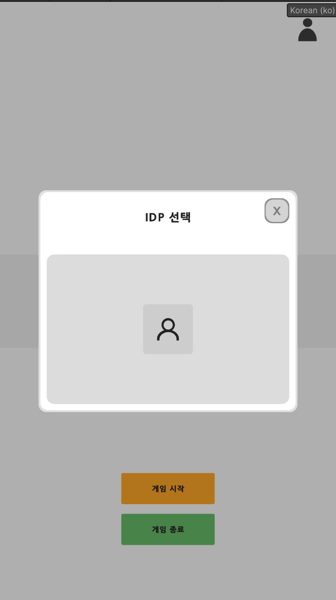
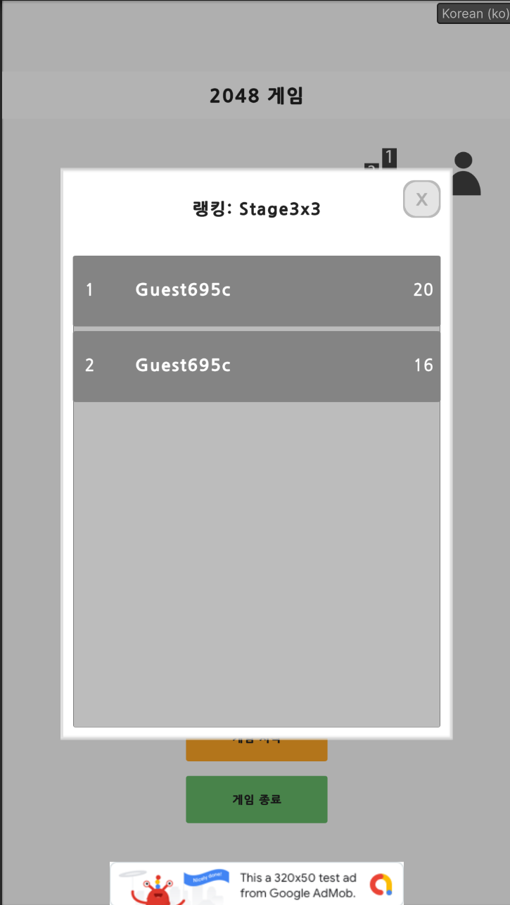

# 2048 Puzzle Game (Unity6 Portfolio Project)

<div align="center">

</div>

---

## 📌 프로젝트 개요

- **개발 기간**: 2025.XX ~ 2025.XX
- **개발 환경**: Unity 6000.0.23f1 / C# / ASP.NET Core / Rider / AWS / Firebase
- **플랫폼**: Android
- **개발 방식**: 1인 개발 (클라이언트 + 서버)
- **목표**: 구조화된 Unity 프로젝트 경험과 다양한 기능 연동 능력을 보여주는 기술 포트폴리오

---

## 🎮 주요 기능 소개

| 항목 | 설명 |
|------|------|
| **2048 퍼즐 게임** | 블록 이동, 병합, 점수 계산, 게임 오버 처리 등 |
| **랭킹 시스템** | 점수 서버 전송 및 랭킹 조회 (ASP.NET Core + PostgreSQL) |
| **게스트 로그인** | UUID 기반 유저 식별, 닉네임 랜덤 생성 |
| **Firebase 연동** | Crashlytics, Analytics, Remote Config |
| **UI 흐름 구조화** | UIScene/Overlay 분리, Stack 기반 UI 관리 |
| **Addressables** | AWS S3 + CloudFront로 원격 리소스 관리 |
| **Command 패턴** | 블록 이동/병합 로직 구조화, Undo/Replay 확장 고려 |
| **Object Pool + Factory** | Block, Board 최적화된 생성/재사용 처리 |
| **Localization** | Unity Localization + Addressables 사용, 다국어 지원 |

---

## 🛠️ 기술 스택 및 구조

- **클라이언트**
  - Unity 6000.0.23f1
  - C# (async/await 중심 구조)
  - uGUI 기반 UI + DOTween 연출
  - Addressables + AWS S3 CDN
  - UnityWebRequest 기반 공통 API 구조
  - Unity Localization, ILoginProvider 패턴
- **서버**
  - ASP.NET Core + PostgreSQL
  - RESTful API 설계
  - 랭킹 등록/조회, 유저 관리
  - 향후 Redis 캐싱 확장 고려

---

## 📱 APK 다운로드

- [APK 바로 다운로드](https://whawoo.xyz/2048.apk) *(최신 빌드 링크 예정)*

---

## 🖼️ 스크린샷

### 🎮 타이틀 화면


### 🧩 로비 (스테이지 선택)


### 🕹️ 인게임 화면


### 📌 IDP 선택 팝업


### 🏆 랭킹 팝업


---

## 🎥 시연 영상

> 추후 추가될 YouTube 링크  
> - 블록 이동 및 병합  
> - 서버 연동 / 랭킹 등록 흐름  
> - Firebase 로그 연동

---

## 🌱 구조 설계 어필 포인트

- **UI 구조 분리**: `UIFlowManager`, `IUIScene`, `IUIOverlay` 구조화
- **API 통신 모듈화**: `ApiClient`, `ApiConnection`, `ApiRequest` 기반 구조
- **패턴 적용**: Command 패턴, Factory 패턴, Interface 기반 구조 설계
- **비동기 구조화**: async/await 활용, Coroutines 최소화
- **확장성 고려**: ILoginProvider 설계 기반으로 소셜로그인 등 확장 여지 내재

---

## 📂 폴더 구조 일부

```text
Assets/
├── Scripts/
│   ├── UI/
│   ├── Game/
│   ├── Network/
│   ├── System/
│   └── Utils/
├── Addressables/
│   ├── Local/
│   └── Remote/ (AWS 연동)
```

---

## 🙋‍♂️ 개발자 소개

> 김성훈 (8년차 Unity 게임 클라이언트 개발자)  
> - 전) Kong Studios Korea (가디언 테일즈 개발 참여)  
> - Unity 기반 상용 게임 다수 라이브 경험  
> - 서버 연동, UI 구조화, 최적화 및 Crash 대응 역량 보유  

포트폴리오 및 블로그: [https://whawoo-gamedev.tistory.com/](https://whawoo-gamedev.tistory.com/)  
이메일: whawoo.kim@gmail.com

---
